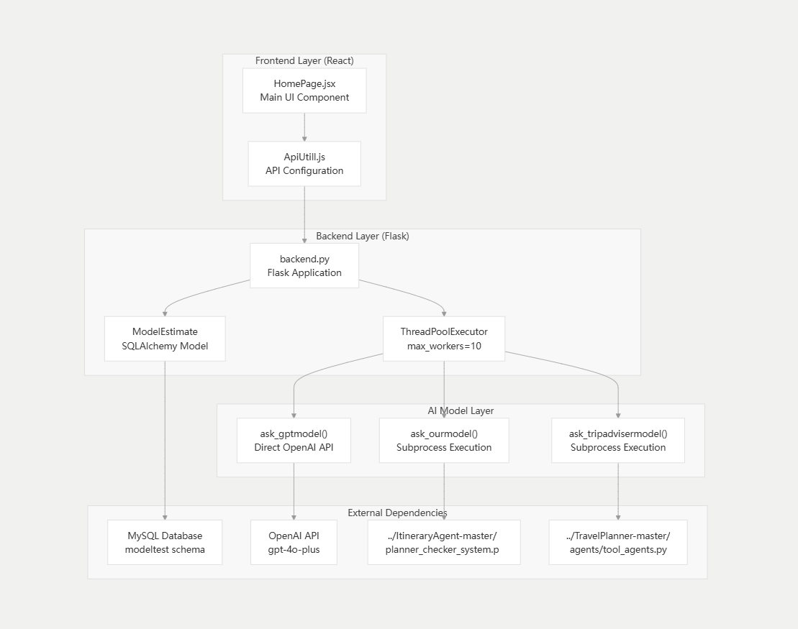

# TravelDesigner旅行规划模型评估代码仓库

[](https://www.python.org/downloads/)
[](https://reactjs.org/)
[](https://flask.palletsprojects.com/)
[](LICENSE)

## 📝 项目概述

这是TravelDesigner的旅行规划AI模型评估代码仓库，用于比较和评估不同AI模型在旅行规划任务上的表现。系统支持三种不同的模型： GPT-4、我们的自研模型和TravelPlanner模型，并提供用户友好的界面进行实时比较和评分。


## 🏗️ 系统架构

### 架构图
系统采用前后端分离架构，支持多模型并行调用和实时评估：



更详细的项目架构解析（AI生成），参阅https://deepwiki.com/Anionex/estimate_model_web

### 目录结构
```
estimate_model_web/
├── back_end/                    # Flask后端服务
│   ├── backend.py              # 主要后端应用
│   ├── restart.sh              # 服务重启脚本
│   └── test.py                 # 测试脚本
├── front_end/                   # React前端应用
│   ├── src/
│   │   ├── Page/
│   │   │   ├── HomePage.jsx    # 主页面组件
│   │   │   └── AboutUs.jsx     # 关于页面
│   │   ├── App.jsx            # 主应用组件
│   │   ├── NavBar.jsx         # 导航栏组件
│   │   └── Router.jsx         # 路由配置
│   ├── package.json           # 前端依赖配置
│   └── vite.config.js         # Vite构建配置
├── ItineraryAgent-master/      # 自研旅行规划Agent
│   ├── agents/                # Agent相关代码
│   ├── tools/                 # 工具函数
│   └── planner_checker_system.py  # 自研系统主模块
├── TravelPlanner-master/       # TravelPlanner基准模型
│   ├── agents/                # Agent实现
│   ├── database/              # 数据库文件
│   ├── tools/                 # 工具集
│   └── evaluation/            # 评估脚本
├── utils/                      # 通用工具
│   ├── chat_model.py          # 聊天模型封装
│   ├── config.py              # 配置文件
│   ├── jsonify_chat_model.py  # JSON化聊天模型
│   └── plan_checker.py        # 计划检查器
└── requirements.txt           # Python依赖
```

## 🚀 主要功能

### 1. 多模型比较
- **GPT-4 (Plan 1)**: 基于OpenAI GPT-4的旅行规划
- **自研模型 (Plan 2)**: 使用ItineraryAgent的自研规划模型
- **TravelPlanner (Plan 3)**: 基于TravelPlanner基准的规划模型

### 2. 实时评估
- 用户输入旅行需求后，系统并行调用三个模型
- 实时显示生成的旅行计划
- 支持Markdown格式的丰富文本显示

### 3. 多维度评分系统
- **详细程度 (Level of Details)**: 0-10分
- **路线合理性 (Route Reasonability)**: 0-10分  
- **代表性 (Representativeness)**: 0-10分
- **整体评分 (Overall Rating)**: 0-10分

### 4. 数据存储与分析
- MySQL数据库存储所有对话和评分数据
- 支持费用信息记录和分析
- 用户反馈收集和存储

### 5. 智能约束检查
- 旅行日期验证（当前日期到未来2个月内）
- 旅行时长限制（最多20天）
- 日期一致性检查


## 📋 环境要求

### 系统环境
- **操作系统**: Windows 10+ (推荐在WSL环境下开发)
- **Python**: 3.9+
- **Node.js**: 16+
- **MySQL**: 8.0+


## 🔧 安装和部署

### 1. 环境准备

```bash
# 克隆项目
git clone https://github.com/Anionex/estimate_model_web
cd estimate_model_web

# 安装Python依赖（使用uv）
uv sync
```

### 2. 数据库配置

```bash
# 启动MySQL服务
mysql -u root -p

# 创建数据库
CREATE DATABASE modeltest;
CREATE USER 'modeltest'@'localhost' IDENTIFIED BY 'root';
GRANT ALL PRIVILEGES ON modeltest.* TO 'modeltest'@'localhost';
FLUSH PRIVILEGES;
```

**初始化数据库表（重要！）**

数据库表不会自动创建，需要手动初始化。有两种方式：

**方式1：使用Flask-Migrate手动初始化**

```bash
cd back_end
export FLASK_APP=backend.py
flask db upgrade
```

### 3. 环境变量配置

在项目根目录创建`.env`文件，示例：

```env
# OpenAI配置
OPENAI_API_KEY=your_openai_api_key
OPENAI_API_BASE=https://api.openai.com/v1

# 数据库配置
DB_PASSWORD=your_mysql_password

# 调试模式
DEBUG=False

# 可选API配置
GOOGLE_API_KEY=your_google_api_key
SERPER_API_KEY=your_serper_api_key
```

### 4. 后端启动

```bash
# 开发环境
cd back_end
python backend.py

# 生产环境（使用Gunicorn）
chmod +x restart.sh
./restart.sh
```

### 5. 前端启动

```bash
cd front_end
# 安装依赖
npm install
# 启动开发服务器
npm run dev
# 构建生产版本
npm run build
```

### 6. 访问应用

- 前端地址: http://localhost:5173
- 后端API: http://localhost:5000

## API

### 核心接口

#### 1. 开始会话
```http
POST /start_session
Content-Type: application/json

{
    "query": "旅行需求描述"
}

Response:
{
    "conversation_id": 123
}
```

#### 2. 查询可用性检查
```http
POST /is_query_available
Content-Type: application/json

{
    "query": "旅行需求描述"
}
```

#### 3. 获取GPT模型规划
```http
POST /ask_gpt
Content-Type: application/json

{
    "query": [
        {"role": "system", "content": "system prompt"},
        {"role": "user", "content": "user query"}
    ],
    "conversation_id": 123
}
```

#### 4. 获取自研模型规划
```http
POST /ask_ourmodel
Content-Type: application/json

{
    "query": [
        {"role": "user", "content": "user query"}
    ],
    "conversation_id": 123
}
```

#### 5. 获取TravelPlanner规划
```http
POST /ask_xxmodel
Content-Type: application/json

{
    "query": [
        {"role": "user", "content": "user query"}
    ],
    "conversation_id": 123
}
```

#### 6. 提交评分
```http
POST /rate
Content-Type: application/json

{
    "conversation_id": 123,
    "gpt": {
        "overall_rating": 8,
        "route_reasonability_rating": 7,
        "representative_rating": 9,
        "level_of_details": 8
    },
    "ourmodel": { /* 同上 */ },
    "xxmodel": { /* 同上 */ },
    "feedback": "用户反馈文本"
}
```


## 工作流程

1. **用户输入**: 用户在前端输入旅行需求
2. **查询验证**: 系统验证查询的有效性和约束条件
3. **会话创建**: 后端创建新的会话记录
4. **并行调用**: 同时调用三个AI模型生成旅行计划
5. **结果展示**: 前端实时显示三个模型的规划结果
6. **用户评分**: 用户对每个模型的表现进行多维度评分
7. **数据存储**: 系统保存所有数据用于后续分析


### API测试示例
```bash
# 测试会话创建
curl -X POST http://localhost:5000/start_session \
  -H "Content-Type: application/json" \
  -d '{"query": "Plan a 3-day trip to New York"}'
```
